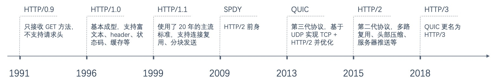

# HTTP浅析

## HTTP版本更迭

* 0.9 :
只有一个get .已经废弃
* 1.0:
默认短连接,控制缓存的头部有`pragma` `Last-Modified` `If-Modified-Since` 新增方法POST 和 HEAD
* 1.1:
增加了新的缓存控制`Cache-Control`、`Etag/If-None-Match` 默认常链接 支持断点续传  新增方法 OPTIONS, PUT, DELETE, TRACE 和 CONNECT
* 2.0:
多路复用,头部压缩, 服务器推送,强制https  HTTP/2 采用二进制格式传输数据，而非文本格式，二进制协议解析起来更高效

* 3.0:

  使用udp替换了tcp

### keep-alive 和 Multiplexing

两者效果类似 , 但是 `keep-alive` 会阻塞请求 , 因此即便开启`keep-alive`, 如果请求较多的情况下仍然会开辟新的请求,HTTP2 Multiplexing 则没有阻塞的情况.

## HTTP状态

- 1xx——指示信息 , 表示请求已接收 , 继续处理
- 2xx——成功 , 表示请求已被成功接收、理解、接受
- 3xx——重定向 , 要完成请求必须进行更进一步的操作
- 4xx——客户端错误 , 请求有语法错误或请求无法实现
- 5xx——服务器端错误 , 服务器未能实现合法的请求

## HTTPS实现

- 操作系统或浏览器内部会持有证书发布机构的证书
- 访问https的时候我们会获取其证书,上面有该证书的发布机构,我们根据内置的证书判断其合法性
- https 客户端第一次发送消息到服务端是非对称,之后是对称加密
- ssl和tls: tls是以ssl3.0为基准的新协议,有时候会统称tls为ssl(一下统称ssl)
- https并非应用层新协议,只是使用了ssl的http而已
- http是直接和tcp通信的,但是当使用https的时候,是由http先与ssl通信,ssl再与tcp通信
- 其实ssl也是网络协议 应用层的一部分,位于会话层,也可以由其他协议使用 ,比如 smtp或telnet等

## 参考

* [HTTP 协议入门](http://www.ruanyifeng.com/blog/2016/08/http.html)
* [keep_alive_vs_multiplexing](https://cascadingmedia.com/insites/2015/03/http-2.html)

* [session正在被淘汰吗？](https://www.zhihu.com/question/315397046/answer/695069994) (实际上这个讨论的是session是怎样的概念)