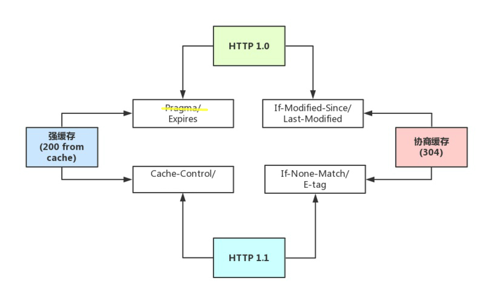

# HTTP缓存策略

> 本来只是想作为 HTTP浅析中的一个章节,后来发现内容比较多还是单独拆开了.

## 缓存分类

HTTP中和缓存相关HTTP头部有 `Pragma` `Expires` `Last-Modified`&`If-Modified-Since`  `Cache-Control` `ETag`&`If-None-Match` ;

### 强缓存

其中上图左侧的被称作**强缓存**.当浏览器首次访问资源时,服务器会把**缓存条件**放到响应头中;当下次浏览器发起请求前,会对条件进行判断,如果成立则无需和服务端有任何交互,直接从本地获取缓存文件.强缓存多见于 CDN 加速 , 被缓存的文件比较稳定,一般情况下不会发生改变.由此可见强缓存具有以下性质:

* 由浏览器判断缓存是否有效
* 缓存生效时可以脱离服务器

### 协商缓存

图中右侧的则被称作**协商缓存**.同样在首次的时候服务器会把**缓存信息**放入到响应头中.当下次浏览器发起请求时,将会携带缓存信息,服务器则会进行判断.如果缓存成立,则会直接返回304,通知浏览器使用缓存.不成立的话则会正常返回200并把更新的文件内容放到返回体中.实际中一般非第三方库的代码大多使用协商缓存.协商缓存性质如下:

* 由服务器判断缓存是否有效
* 即便缓存生效也需要进行一次HTTP请求

### 一个小疑问

关于**强缓存**与**协商缓存** 我翻阅了一些资料,并没有找到确切的描述,感觉更像是约定俗成的叫法,而非官方规范.不过这种分类我还是比较赞同的,因为分组间行为差异较大,分组内比较统一

## HTTP缓存头部信息

### Pragma

HTTP 1.0时代的产物,严格来说 , 它不属于专门的缓存控制头部,所以图中我用了黄色线划去.如果`Cache-Control` 不存在的话,`Pragma: no-cache`的行为与`Cache-Control: no-cache` 一致。用来向后兼容只支持 HTTP/1.0 协议的缓存服务器.

### Expires

服务端配置的，用来控制在规定的时间之前，浏览器不发出请求，而是直接使用本地缓存.Expires一般对应服务器端时间. 可能会有时区的问题

### Last-Modified&If-Modified-Since

由响应头`Last-Modified`和请求头`If-Modified-Since` 共同作用生效 , 可根据文件的修改时间判断缓存是否生效.当首次请求资源时,浏览器会把文件的修改日期加入到`Last-Modified` ,之后浏览器再次访问资源时,则会把修改信息放入到请求头`If-Modified-Since` 中,服务器可以根据修改时间来判断缓存是否有效. 但其实有两个缺点: 

* 精度只能到秒,不能判断秒以下修改
* 如果前端静态资源有负载均衡,文件的修改时间需要做同步,否则有可能造成缓存无效

### Cache-Control 

这一部分MDN描述的比较详细,不再献丑: [Cache-Control](https://developer.mozilla.org/zh-CN/docs/Web/HTTP/Headers/Cache-Control)

### E-tag&If-None-Match

基本行为如同 `Last-Modified&If-Modified-Since` ,但这两个头部对应的值为 文件指纹,而非修改时间.因为与时间无关,所以也就跳过了他们两个的缺点.另外`E-tag` 还可与[`If-Match`](https://developer.mozilla.org/zh-CN/docs/Web/HTTP/Headers/If-Match)  配合,实现类似cas的功能,详见:[避免“空中碰撞”](https://developer.mozilla.org/zh-CN/docs/Web/HTTP/Headers/ETag#%E9%81%BF%E5%85%8D%E2%80%9C%E7%A9%BA%E4%B8%AD%E7%A2%B0%E6%92%9E%E2%80%9D)

## 缓存实践

* 以 nginx 为例 , 如果不显示声明静态资源的缓存策略 , 则会同时返回 `E-tag` 和`Last-Modified`
* 缓存顺序上:先判断 强缓存,后协商缓存;同类型下,先使用HTTP1.1的,如果没有再使用HTTP1.0
* 缓存文件按照 存储的位置可分为`disk cache` `memory cache` ,不过具体策略并没有规范.但其实对用户来说都是透明的;另外 也有资料提到 `Service Worker` ,但我并没有发现有网站采用该技术,同时MDN上的[文档](https://developer.mozilla.org/zh-CN/docs/Web/API/ServiceWorker)也未说明其用于缓存

## 参考

* [从输入URL到页面加载的过程？如何由一道题完善自己的前端知识体系！](https://zhuanlan.zhihu.com/p/34453198)

  * 勘误: 

    > 对于协商缓存，使用`Ctrl + F5`强制刷新可以使得缓存无效
    >
    > 但是对于强缓存，在未过期时，必须更新资源路径才能发起新的请求（更改了路径相当于是另一个资源了，这也是前端工程化中常用到的技巧）
    
    实际上 `ctrl+F5` 刷新页面时肯定会使缓存无效
    另外本文图片也修改自原页面 加入了一些自己的理解

* [一文读懂前端缓存](https://zhuanlan.zhihu.com/p/44789005)

* [HTTP 缓存](https://developer.mozilla.org/zh-CN/docs/Web/HTTP/Caching_FAQ)