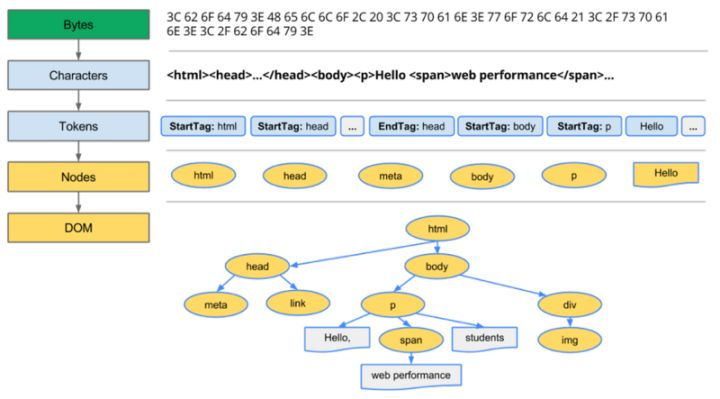
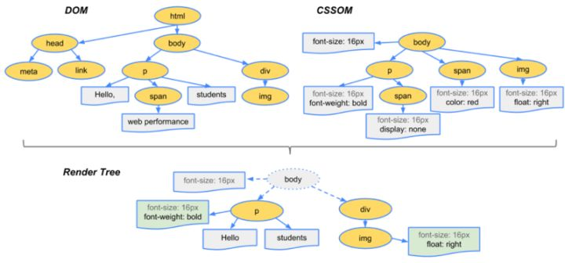

> 曾经被面试到这个问题 , 自己也比较感兴趣 , 故"拼凑"成这篇文章

## 浏览器线程

- Browser进程 : 浏览器的主进程 (负责协调、主控), 只有一个

- 第三方插件进程 : 每种类型的插件对应一个进程 , 仅当使用该插件时才创建

- GPU进程 : 最多一个 , 用于3D绘制

- 浏览器渲染进程 (内核) : 默认每个Tab页面一个进程 , 互不影响 , 控制页面渲染 , 脚本执行 , 事件处理等 (有时候会优化 , 如多个空白tab会合并成一个进程)

  - GUI线程
    - 负责渲染浏览器界面 , 解析HTML,CSS, 构建DOM树和RenderObject树 , 布局和绘制等 .
    - 当界面需要重绘 (Repaint) 或由于某种操作引发回流 (reflow) 时 , 该线程就会执行
    - 注意 ,**GUI渲染线程与JS引擎线程是互斥的**, 当JS引擎执行时GUI线程会被挂起 (相当于被冻结了),GUI更新会被保存在一个队列中**等到JS引擎空闲时**立即被执行 .
  - JS引擎线程
  - 事件触发线程
    - 归属于浏览器而不是JS引擎 , 用来控制事件循环 (可以理解 ,JS引擎自己都忙不过来 , 需要浏览器另开线程协助)
    - 当JS引擎执行代码块如setTimeOut时 (也可来自浏览器内核的其他线程 , 如鼠标点击、AJAX异步请求等), 会将对应任务添加到事件线程中
    - 当对应的事件符合触发条件被触发时 , 该线程会把事件添加到待处理队列的队尾 , 等待JS引擎的处理
    - 注意 , 由于JS的单线程关系 , 所以这些待处理队列中的事件都得排队等待JS引擎处理 (当JS引擎空闲时才会去执行)
  - 定时器线程
    - `setInterval`与`setTimeout`  并不是由JS引擎计数的 , 计时完毕后 , 添加到事件队列中 , 等待JS引擎空闲后执行 , 另外由于js是单线程 , 所以虽然时间到的时候可以推入到事件队列 . 但是有可能当时正在执行其他任务 , 造成时间不准确
  - 网络请求线程

## 网络请求相关

* 域名解析ip, 查找顺序

  * 查询浏览器缓存
  * 本机缓存
  * hosts
  * 远程dns

* 常见http状态
  * 1xx——指示信息 , 表示请求已接收 , 继续处理
  * 2xx——成功 , 表示请求已被成功接收、理解、接受
  * 3xx——重定向 , 要完成请求必须进行更进一步的操作
  * 4xx——客户端错误 , 请求有语法错误或请求无法实现
  * 5xx——服务器端错误 , 服务器未能实现合法的请求

* cros

  * 简单请求 , 非简单请求

    简单请求可以由浏览器直接发送到服务器 , 而非简单请求则需要发送一个 "预检"请求`OPTIONS` 

* keep-alive 和 HTTP2 Multiplexing

  两者效果类似 , 但是 `keep-alive` 会阻塞请求 , 因此即便开启`keep-alive`, 如果请求较多的情况下仍然会开辟新的请求 .HTTP2 Multiplexing 则没有阻塞的情况

  

* http版本

  * 0.9 只有get请求 , 返回的只有`HTML `
  * 1.0 增加`POST ` `HEAD ` , 制定了请求头和返回头的标准 ,
  * 1.1 增加`PUT`,`PATCH`,`HEAD`,`OPTIONS`,`DELETE` ;增加持久连接 , 即`Connection: keep-alive `
  * 2     Multiplexing, 服务器推送 , 头信息压缩

* https

  * 服务器保存一份公钥到CA认证中心
  * 浏览器去从认证中心得到公钥加密一个随机生成的对称的秘钥
  * 服务器通过私钥解密得到浏览器传过来的秘钥
  * 双方通过秘钥进行加解密

* 浏览器缓存

  * E-tag 

    类似文件指纹 , 文件改变之后这个的值就会发生变化 http 1.1

  * Last-Modified 

    表明文件最后修改时间 http 1.0

  ## 页面渲染

  大致步骤

  * 解析HTML, 构建DOM树
  * 解析CSS, 生成CSS规则树
  * 合并DOM树和CSS规则 , 生成render树
  * 布局render树 (Layout/reflow), 负责各元素尺寸、位置的计算
  * 绘制render树 (paint), 绘制页面像素信息
  * 浏览器会将各层的信息发送给GPU,GPU会将各层合成 (composite), 显示在屏幕上

  

## 参考资料

* [从输入URL到页面加载的过程？如何由一道题完善自己的前端知识体系！](https://zhuanlan.zhihu.com/p/34453198)
* [HTTP 协议入门](http://www.ruanyifeng.com/blog/2016/08/http.html)
* [keep_alive_vs_multiplexing](https://cascadingmedia.com/insites/2015/03/http-2.html)
* [跨域资源共享 CORS 详解](http://www.ruanyifeng.com/blog/2016/04/cors.html)

## 勘误

* 『 从输入URL到页面加载的过程 ..』, 提到的 "**get和post的区别**" 中有错误 , 纠正部分可以参考 [听说『99% 的人都理解错了 HTTP 中 GET 与 POST 的区别』？？](https://zhuanlan.zhihu.com/p/25028045)
* [跨域资源共享 CORS 详解](http://www.ruanyifeng.com/blog/2016/04/cors.html) 中 关于`Access-Control-Allow-Credentials ` 描述不正确 , 校准部分参考 [HTTP访问控制](https://developer.mozilla.org/zh-CN/docs/Web/HTTP/Access_control_CORS)
