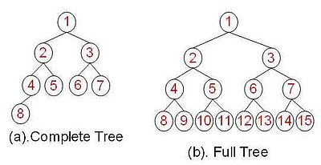
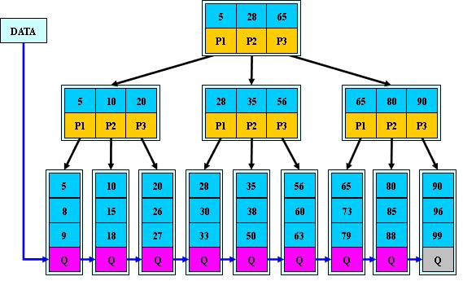

# 几种常见的排序数据结构

## 二叉树系列

二叉树（英语：Binary tree）是每个节点最多只有两个分支的[树结构 ](https://zh.wikipedia.org/wiki/树结构) ;

### 满二叉树和完全二叉树

在一棵二叉树中,除最后一层外,若其余层都是满的,则这棵树称为满二叉树（Full Binary Tree）(注:关于满二叉树国内[外](https://en.wikipedia.org/wiki/Binary_tree#Types_of_binary_trees)定义略有不同)

而在一棵二叉树中，除最后一层外，若其余层都是满的，并且最后一层或者是满的，或者是在右边缺少连续若干节点，则此二叉树为完全二叉树（Complete Binary Tree）

### 平衡二叉搜索树

**平衡二叉搜索树**（英语：Balanced Binary Tree）是一种结构平衡的[二叉搜索树](https://zh.wikipedia.org/wiki/二叉搜索树)，即叶节点高度差的绝对值不超过1，并且左右两个子树都是一棵平衡二叉树。它能在O(logN)内完成插入、查找和删除操作

常见的平衡二叉搜索树有：

- [AVL树](https://zh.wikipedia.org/wiki/AVL树)

  avl树中,任一节点对应的两棵子树的最大高度差为1.当添加完节点后,需要递归判断对父亲节点的高度差有没有影响.为了效率,父亲节点会保存儿子节点的树高

- [红黑树](https://zh.wikipedia.org/wiki/紅黑樹)

  avl树中需要维护左右子树的高度差,而在红黑树中,这个高度差变成了颜色.相比较而言红黑树的实现比avl树简单一些. java8中的hashmap中也有红黑树的实现(不过[java8的红黑树](https://github.com/changdy/codingdoc/blob/master/%E6%88%91%E7%9C%9F%E7%9A%84%E5%8F%AA%E4%BC%9Ajava/JDK8%20HashMap%E8%A7%A3%E6%9E%90.md#hashmap%E5%A6%82%E4%BD%95%E5%A4%84%E7%90%86%E9%87%8D%E5%A4%8D%E7%9A%84hashcode)实现并不严格).当把新节点插入到红色节点下面之后则需要进行平衡性调整.如果调整之后爷爷节点的颜色发生变化,则需要递归平衡.

- [Treap](https://zh.wikipedia.org/wiki/Treap)

- 节点大小平衡树

### 参考

* [红黑树详细分析，看了都说好](https://segmentfault.com/a/1190000012728513)
* [漫画：什么是红黑树？](https://juejin.im/post/5a27c6946fb9a04509096248)
* [听说你还不懂什么是红黑树（Red-black-tree）？](https://zhuanlan.zhihu.com/p/55255223)

## B 树及 B+树

AVL和红黑树虽好,但是树的高度却降不下来,这在内存中,并不是大问题,但如果在硬盘中,则会造成频繁的IO读取,严重降低速度,因此很有必要降低树的高度.即增加二叉树的度

###  B树

  

  也被写做B-树,其所有叶子结点位于同一层.B-tree中每个结点包含：

* 本结点所含关键字的个数

* 指向父结点的指针

* 关键字

* 指向子结点的指针数组

### B+ 树

B+树是对B树的优化,有以下特点

* 叶子结点中包含了全部关键字的信息
* 叶子结点本身依关键字的大小进行顺序链接
* 只有叶子节点携带卫星数据,而非叶子节点不携带数据

主要优点是

* 中间节点去掉了卫星数据,则一次加载的信息更多,减少了io;
* 查找更加稳定(这个其实我很纳闷,算是优点?)
* 范围查找非常容易

### 参考

* [漫画：什么是B-树？](https://zhuanlan.zhihu.com/p/54084335)
* [漫画：什么是B+树？](https://zhuanlan.zhihu.com/p/54102723)
* [B-树，B+树，B*树详解](https://blog.csdn.net/aqzwss/article/details/53074186)

## 跳表

[跳表](https://zh.wikipedia.org/wiki/%E8%B7%B3%E8%B7%83%E5%88%97%E8%A1%A8)是在有序链表的基础上发展起来的,redis 的sorted set就是使用跳表实现的

跳表快速查询是通过维护一个多层次的链表 , 且每一层链表中的元素是前一层链表元素的子集 . 查找的时候 逐层确定元素位置 , 跳表插入新元素时 , 为了避免移动太多元素 , 采用了随机往上抛的策略.

### 参考

* [跳表这种高效的数据结构，值得每一个程序员掌握](https://zhuanlan.zhihu.com/p/54869087)
* [漫画：什么是跳表？](https://zhuanlan.zhihu.com/p/53975333)