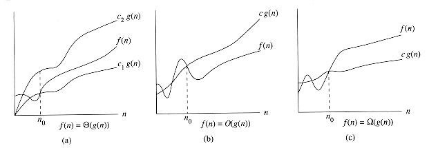

# 数据结构与算法 学习

## 第一章

### 算法

* N:问题的规模 ,I:输入 ,A:算法本身
* 用C表示复杂性 , 则C=F(N,I,A). 一般把时间复杂性和空间复杂性分开 , 用T和S来表示 , 则有 :T=T(N,I) 和S=S(N,I) 
* 比较算法的时候经常使用渐近性态 , 渐近性态直观上是略去低阶项所留下的主项
* 渐近分析 
	

## 第二章

* 哈希冲突处理方法
  * 开放地址法
  * 再哈希 
  * 链地址 (jdk7 实现原理)
  * 公共溢出法 