# 从输入URL到页面加载的过程

由于不同浏览器其进程划分以及页面解析, 渲染的情况并不相同 , 所以本文中的浏览器如果没有特殊声明即特指Chrome

## 浏览器进程概述

首先介绍下浏览器的进程组成 , 主要有以下进程

* Browser进程 , 只有一个。作用如下:
  * 浏览器的主进程 , 负责协调、主控 创建 其他进程
  * 负责浏览器界面显示，并且监听用户操作 , 如 点击标签 , 输入地址栏 . 并将这些信息传递到 TAB页进程的事件触发线程
  * 将Renderer进程得到的内存中的Bitmap，绘制到用户界面上
  * 发送与接受请求 , 管理请求池 , 同样也需要把结果 传递到 TAB页进程的事件触发线程

* 扩展程序进程

  一般不影响主流程 , 不做介绍

* GPU进程

  有点不太明白用途 , 亦不误人子弟

* Renderer 进程

  负责显示网站的选项卡内的所有内容 , 一般情况下每个Tab页对应一个渲染进程 , 这样的话页面之间相互隔离 , 不会因为一个页面的崩溃导致所有页面也出现问题 , 并且安全性也容易保障

各个进程之间的交互情况如下:

## 步骤拆分

### 响应用户输入

首先 , 浏览器的UI线程会最早响应到地址栏的输入 ,解析并判断是将你的输入发送到搜索引擎还是去请求对应的网站。

### 网络请求

UI线程告知 网络线程 获取资源 , 这里面按照先后顺序会涉及到以下知识点:

* 域名解析 DNS UDP
* HTTP TCP/IP HTTPS加密
* keep-alive 与浏览器HTTP连接池
* HTTP状态码 301 302 一般行为
* 浏览器缓存

### 如何处理请求资源

HTTP 相应头中 , 由 `Content-Disposition` 决定是对资源进行渲染还是下载 ;

而 `content-type` 则声明了 资源的类型 , 浏览器会根据这个以进行不同的渲染  .

这里先假设返回的是 `text/html` 即HTML文档

### 页面的渲染

UI线程把资源通过`IPC` 发送到页面的渲染进程 , 最后渲染成页面 . 这个步骤中涉及到以下知识点

* [meta](https://developer.mozilla.org/zh-CN/docs/Web/HTML/Element/meta) 标签对页面的影响
* 外部script标签会暂停页面的渲染 , 而添加 `defer` 或` async ` 会有不同效果
* CSS规则 和CSS规则优先级
* DOM树 ,render 树
* JS 的运行机制
* 用户点击 滚动 等操作的相应(其实这个还是由浏览器的 UI线程 下发到 渲染线程 并再次进行处理)
* mircotask marcotask WebWorker

## 后记

其实从输入URL到页面展示 是个很不错的面试题. 我最近也看了很多资料想丰富下自己的知识储备 . 但感觉部分资料上有冲突的地方 , 比如 渲染进程的组成 在看到的几篇文章中就有不同之处.

## 参考

* [任务队列、事件循环与定时器](http://hpoenixf.com/posts/21689/)
* [从输入URL到页面加载的过程？如何由一道题完善自己的前端知识体系！ - 知乎](https://zhuanlan.zhihu.com/p/34453198)
* [浏览器的工作原理：现代网络浏览器幕后揭秘 - HTML5 Rocks](https://www.html5rocks.com/zh/tutorials/internals/howbrowserswork/)
* [从浏览器多进程到JS单线程，JS运行机制最全面的一次梳理 - 程序生涯](https://segmentfault.com/a/1190000012925872)
* [WEB请求过程(http解析,浏览器缓存机制,域名解析,cdn分发)](https://www.cnblogs.com/wade-luffy/p/5905786.html)
* [从Chrome源码看事件循环 - 知乎](https://zhuanlan.zhihu.com/p/48522249)
* [一文看透浏览器架构 - 腾讯云技术社区](https://segmentfault.com/a/1190000018277184)
* [【译】现代浏览器探秘（part 1）：架构 - 疯狂的技术宅](https://segmentfault.com/a/1190000017896594)
* [现代浏览器探秘（part2）：导航 - 疯狂的技术宅](https://segmentfault.com/a/1190000017896809)
* [现代浏览器探秘（part3）：渲染 - 疯狂的技术宅](https://segmentfault.com/a/1190000017900258)
* [现代浏览器探秘（part4）：事件处理 - 疯狂的技术宅](https://segmentfault.com/a/1190000017917575)