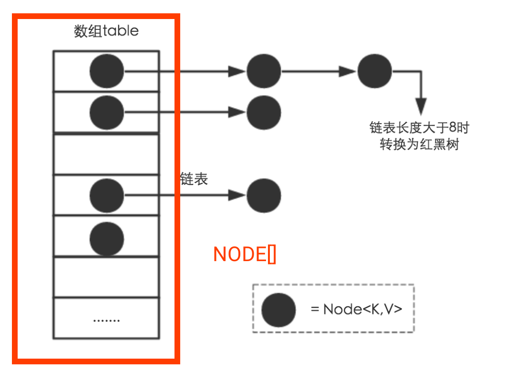

# JDK8 HashMap解析

> 参考https://zhuanlan.zhihu.com/p/21673805 https://zhuanlan.zhihu.com/p/27325430

## HashMap特点

它根据键的hashCode值存储数据 , 大多数情况下可以直接定位到它的值 , 因而具有很快的访问速度 , 但遍历顺序却是不确定的 . HashMap最多只允许一条记录的键为null, 允许多条记录的值为null.HashMap非线程安全 , 即任一时刻可以有多个线程同时写HashMap, 可能会导致数据的不一致 . 如果需要满足线程安全 , 可以用 Collections的synchronizedMap方法使HashMap具有线程安全的能力 , 或者使用ConcurrentHashMap.

## HashMap内部存储结构

结构实现来讲 ,HashMap是数组+链表+{红黑树 (JDK1.8) 或LinkedList(jdk1.7)}实现

其中的数组是Node[] table,Node为一个内部类有一个 , 内部类中有个 `Node<K,V> next`, 为下个节点的地址

得到数组中下标的方式如下

```java
//步骤1 如果步骤1中得到的hash一样 , 则说明发生了hash碰撞
static final int hash(Object key) {   //jdk1.8 & jdk1.7
     int h;
     // h = key.hashCode() 为第一步 取hashCode值
     // h ^ (h >>> 16)  为第二步 高位参与运算
     return (key == null) ? 0 : (h = key.hashCode()) ^ (h >>> 16);
}
//步骤2 jdk1.7的源码 ,jdk1.8没有这个方法 , 但存在该代码块
static int indexFor(int hash, int length) {
     return hash & (length-1);  //第三步 hash对length取模
}
// 步骤 :取key的hashCode值、高位运算、取模运算 .
```



## HashMap put方法


```java
final V putVal(int hash, K key, V value, boolean onlyIfAbsent, boolean evict) {
    Node<K, V>[] tab;
    Node<K, V> p;
    int n, i;
    // 步骤① : tab为空则创建
    if ((tab = table) == null || (n = tab.length) == 0)
        n = (tab = resize()).length;
    // 步骤② : 计算index, 并对null做处理 
    if ((p = tab[i = (n - 1) & hash]) == null)
        tab[i] = newNode(hash, key, value, null);
    else {
        Node<K, V> e;K k;
        // 步骤③ : 节点key存在 , 直接覆盖value
        if (p.hash == hash && ((k = p.key) == key || (key != null && key.equals(k))))
            e = p;
        // 步骤④ : 判断该链为红黑树
        else if (p instanceof TreeNode) 
          e = ((TreeNode<K, V>) p).putTreeVal(this, tab, hash, key, value);
        // 步骤⑤ : 该链为链表
        else {
            for (int binCount = 0; ; ++binCount) {
                if ((e = p.next) == null) {
                    p.next = newNode(hash, key, value, null);
                    //链表长度大于8转换为红黑树进行处理
                    if (binCount >= TREEIFY_THRESHOLD - 1) // -1 for 1st  
                        treeifyBin(tab, hash);
                    break;
                }
                // key已经存在直接覆盖value
                if (e.hash == hash && ((k = e.key) == key || (key != null && key.equals(k))))
                    break;
                p = e;
            }
        }
        if (e != null) { // existing mapping for key
            V oldValue = e.value;
            if (!onlyIfAbsent || oldValue == null)
                e.value = value;
            afterNodeAccess(e);
            return oldValue;
        }
    }
    ++modCount;
    // 步骤⑥ : 超过最大容量 就扩容
    if (++size > threshold)
        resize();
    afterNodeInsertion(evict);
    return null;
}
```

 感觉步骤3中描述有错误

## HashMap 扩容

当执行put方法之后 , 如果size > threshold(即 length * Load factor) 时 , 则需要执行扩容方法 (resize)

jdk7中是每个在执行resize时每个都需要重新计算新的索引 , 即执行indexFor(e.hash, newCapacity); 

而jdk8则比较聪明一些 , 挂载在某个Node上的节点在新的数组中只会出现在两个固定的位置 :


两种的位置通过高位来判定

## HashMap小结

* 扩容是一个特别耗性能的操作 , 所以当使用HashMap的时候 , 估算map的大小 , 初始化的时候给一个大致的数值 , 避免map进行频繁的扩容
* HashMap是线程不安全的 , 不要在并发的环境中同时操作HashMap(Node.next有可能会造成闭合环), 建议使用ConcurrentHashMap
* 当val为 `Null`的时候 , 放在了数组的头部
* 如果想得到支持多线程的Map, 可以使用`ConcurrentHashMap` 或者`Collections.synchronizedMap(new HashMap<>());`
  * `ConcurrentHashMap`  jdk7中是使用分段锁来实现的 , 而jdk8中是通过CAS实现
  * `Collections` 则是通过synchronized关键字解决多线程的问题 , 使用了装饰设计的模式

* 1.8 的扩容时 , 只需要看高一位 , 设计十分巧妙
* key最好是不可变类 , 否则有可能找不到 原因 (hash 已经固定到node的hash里面)
* 1.8多线程扩容下已经不会引起闭环 , 但是有数据一致性的问题

## 线程安全map小结
  在JDK1.7的时候 ,ConcurrentHashMap(分段锁) 对整个桶数组进行了分割分段 (Segment), 每一把锁只锁容器其中一部分数据 , 多线程访问容器里不同数据段的数据 , 就不会存在锁竞争 , 提高并发访问率 . 到了 JDK1.8 的时候已经摒弃了Segment的概念 , 而是直接用 Node 数组+链表+红黑树的数据结构来实现 , 并发控制使用 synchronized 和 CAS 来操作 .(JDK1.6以后 对 synchronized锁做了很多优化) 整个看起来就像是优化过且线程安全的 HashMap, 虽然在JDK1.8中还能看到 Segment 的数据结构 , 但是已经简化了属性 , 只是为了兼容旧版本；
  Hashtable(同一把锁) :使用 synchronized 来保证线程安全 , 效率非常低下 . 当一个线程访问同步方法时 , 其他线程也访问同步方法 , 可能会进入阻塞或轮询状态 , 如使用 put 添加元素 , 另一个线程不能使用 put 添加元素 , 也不能使用 get, 竞争会越来越激烈效率越低 .

## HashMap如何处理重复的hashcode

其实HashMap不是标准的红黑树 , 其值 (hash) 是允许重复的 , 当hashcode重复时 ,hashmap会判断key是否实现了`Comparable`, 如果实现了先尝试比较 , 如果没有或者两者比较结果平衡则使用navie方法`System.identityHashCode`比较 , 然后再决定插入节点