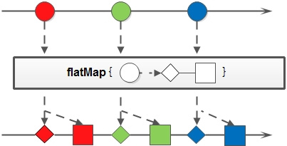

# java8 Stream 笔记

> 系统的学习下java8 Stream流

## Stream介绍

Java 8 API添加了一个新的抽象称为流Stream, 可以让你以一种声明的方式处理数据 .

使用Stream的代码逻辑更加清晰 , 可读性更高 , 每个步骤具有自己的功能 . 并且针对大量数据 , 可以将其声明为并行流 , 最大化利用多线程 , 而不需要开发人员过多的关心线程安全问题 (但其实如果知识简单的 分组统计 , 不建议使用并行流 , 因为线程的切换反而带来性能的损耗);

串行流创建方式 :`Collection.stream`,`Arrays.stream`,`Stream.of`

## 常见方法及分类

<table>
  <tr>
    <td rowspan="2">中间操作<br/>(intermediate operation)</td>
    <td>无状态 (stateless)</td>
    <td>unordered,filter,map,flatMap,peek</td>
  </tr>
  <tr>
    <td>有状态 (stateful)</td>
    <td>distinct,sorted,limit,skip</td>
  </tr>
  <tr>
    <td rowspan="2">最终操作<br/>(terminal operation)</td>
    <td>延迟执行 (laziness)</td>
    <td>forEach,forEachOrdered,<br/>toArray,reduce,collect,max,min,count</td>
  </tr>
  <tr>
    <td>短路 (short-circuiting)</td>
    <td>anyMatch,allMatch,noneMatch,findFirst,findAny</td>
  </tr>
</table>

### 名词介绍

* **Stream中的操作可以分为两大类** : 中间操作与结束操作 , 中间操作只是对操作进行了记录 , 只有结束操作才会触发实际的计算 (即惰性求值);另外要记住Stream其实是个流 , 只能求一次最终操作 , 下次的话需要重新构建
* 结束操作又可以分为短路与非短路操作 , 前者是指遇到某些符合条件的元素就可以得到最终结果；而后者是指必须处理所有元素才能得到最终结果

### 部分方法介绍

* flatMap

  和map类似 , 不同的是其每个元素转换得到的是Stream对象 , 会把子Stream中的元素压缩到父集合中
  
  


* peek

  和forEach功能类似 , 但不触发最终操作 . 可以打个日志看看信息之类的

* forEachOrdered

  串行情况下和`forEach`一致 , 并行情况下`forEach`并不一定保证顺序 . 但是`forEachOrdered`会保证其顺序

* unordered

  用于并行流的位置排序 , 参考 :[Stream ordered/unordered problems](https://stackoverflow.com/questions/21350195/stream-ordered-unordered-problems)

## 代码demo

### 基础方法

* 字符串拼接

    ```java
    Stream.of("Across", "the", "Great", "Wall", "we", "can", "reach", "every", "corner", "in", "the", "world")
            .collect(Collectors.joining("'", " ", "'"));
    ```

* 收集器相关

  基础pojo类
  
  ```java
  @Data
  @NoArgsConstructor
  @AllArgsConstructor
  public class ScoreInfo {
      private String subjectId;// 科目id
      private String subjectName;//科目名称
      private Double score;//得分
    private String studentName;//学生姓名
  }
  ```
  
  基础list
  
  ```java
  List<ScoreInfo> list = new ArrayList<>();
  ```
  
  * 分组后自定义value
  
    ```java
    list.stream()
            .collect(Collectors.groupingBy(
                    ScoreInfo::getSubjectId, reducing(
                            new BigDecimal(0),
                            x -> new BigDecimal(x.getScore() > 10 ? 10 : 0),
                            BigDecimal::add)));
    ```
  
  * 分组求值
  
    ```java
    list.stream()
            .collect(Collectors.groupingBy
                    (ScoreInfo::getSubjectId, Collectors.averagingDouble(ScoreInfo::getScore)));
    ```
  
    此外 `averagingDouble`可以换成`summarizingDouble` `summingInt` `counting`等等
    
  * 分组累加
  
    ```java
    list.stream()
            .collect(Collectors.groupingBy
                    (ScoreInfo::getSubjectId, mapping(ScoreInfo::getStudentName, toList())));
    ```
  
  * 求最大值
      ```java
    list.stream().max(Comparator.comparing(ScoreInfo::getScore));
    ```
    

### java reduce和collect 方法对比

根据上文中的list, 想要实现以科目进行分组 , 统计学生的得分情况 , 返回的结构如下 :

```java
@Data
@NoArgsConstructor
@AllArgsConstructor
public class SubjectAnalysis {
    private String subjectId;
    private String subjectName;
    private List<StudentScore> studentScores;
}
```

```java
@Data
@NoArgsConstructor
@AllArgsConstructor
public class StudentScore {
    private Double score;
    private String studentName;
}
```

reduce实现 :

```java
list.stream().parallel().reduce(new ArrayList<>(), (acc, x) -> {
    ArrayList<SubjectAnalysis> result = new ArrayList<>(acc);
    Optional<SubjectAnalysis> first = result.stream().filter(t -> t.getSubjectId().equals(x.getSubjectId())).findFirst();
    StudentScore studentScore = new StudentScore(x.getScore(), x.getStudentName());
    if (first.isPresent()) {
        first.get().getStudentScores().add(studentScore);
    } else {
        ArrayList<StudentScore> l = new ArrayList<>();
        l.add(studentScore);
        result.add(new SubjectAnalysis(x.getSubjectId(), x.getSubjectName(), l));
    }
    return result;
}, (left, right) -> {
    ArrayList<SubjectAnalysis> subjectAnalyses = new ArrayList<>(left);
    subjectAnalyses.addAll(right);
    return subjectAnalyses;
});
```

collect实现

```java
list.stream().reduce(new ArrayList<>(), (acc, x) -> {
    ArrayList<SubjectAnalysis> result = new ArrayList<>(acc);
    Optional<SubjectAnalysis> first = result.stream().filter(t -> t.getSubjectId().equals(x.getSubjectId())).findFirst();
    StudentScore studentScore = new StudentScore(x.getScore(), x.getStudentName());
    if (first.isPresent()) {
        first.get().getStudentScores().add(studentScore);
    } else {
        ArrayList<StudentScore> l = new ArrayList<>();
        l.add(studentScore);
        result.add(new SubjectAnalysis(x.getSubjectId(), x.getSubjectName(), l));
    }
    return result;
}, (left, right) -> {
    ArrayList<SubjectAnalysis> subjectAnalyses = new ArrayList<>(left);
    subjectAnalyses.addAll(right);
    return subjectAnalyses;
});
```

总结 :

先看两者的方法签名

*  `<U> U reduce(U identity, BiFunction<U, ? super T, U> accumulator, BinaryOperator<U> combiner);`
* `<R> R collect(Supplier<R> supplier,BiConsumer<R, ? super T> accumulator,BiConsumer<R, R> combiner)`

可以看到两者其实非常相近 , 只是collect开始的时候由一个`Supplier`构建 , 之后方法不需要有返回值 , 而reduce是由一个实例开始 , 但后续方法需要有返回值 (如果没有的话 , 再串行情况下不会报错 , 但是如果并行处理则会有异常). 刚开始的时候 , 我只会reduce, 对reduce这种操作非常难理解 . 之后再学习了collect方法之后豁然开朗 , 两者虽然都能实现类似功能 , 但意义不一样 :

* reduce:中文缩小的意思 . 侧重于把数据压缩成一个实例 , 所有线程共享初始变量
* collect:中文收集的意思 , 侧重于将数据进行收集处理 , 所有线程都会调用工厂方法

## Stream的多线程

并且同时注意到我虽然在上述代码中使用了并行处理 , 但并没有使用juc. 这是因为Stream使用了forkjoin的思路 , 所以当使用多线程的时候 , 并不会有线程安全的问题 . 但是会有排序的问题 , 有可能会返回不同的期望值 , 这点需要额外注意

* 默认线程数量

  默认线程数量应该和可使用的CPU数量相关

* 手动设置线程数量

  ```java
  System.setProperty("java.util.concurrent.ForkJoinPool.common.parallelism","30");
  ```

## Stream与BaseStream

* `Arrays.stream` 有以下重载

    ```java
    <T> Stream<T> stream(T[] array) 
    <T> Stream<T> stream(T[] array, int startInclusive, int endExclusive) 
    IntStream stream(int[] array) 
    IntStream stream(int[] array, int startInclusive, int endExclusive) 
    LongStream stream(long[] array) 
    LongStream stream(long[] array, int startInclusive, int endExclusive) 
    DoubleStream stream(double[] array) 
    DoubleStream stream(double[] array, int startInclusive, int endExclusive) 
    ```

    可以看到 非基本对象的数组和基本对象的数组使用 `Arrays.stream` 后返回的对象并不相同 , 同时IntStream,LongStream等并没有继承`java.util.stream.Stream` 而是继承自`BaseStream` . 但大多数方法和`Stream`保持一致 , 不过多了一些`sum` `summaryStatistics`等和统计有关的方法

* stream 与BaseStream的转换

  ```java
  BaseStream.mapToObj();// BaseStream 转Stream
  Stream.mapToInt();// 转Stream转BaseStream
  ```

* 除了由`int` `long` `double` 组成的数组可以通过`Arrays.stream` 得到`BaseStream`之外 , 由其他基本对象组成的数组需要变成其包装类之后才能进行stream操作

  ```java
  Arrays.stream({'1', '2', '3'});// 报错
  ```

