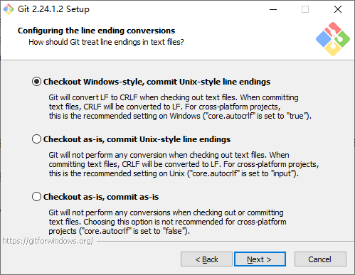
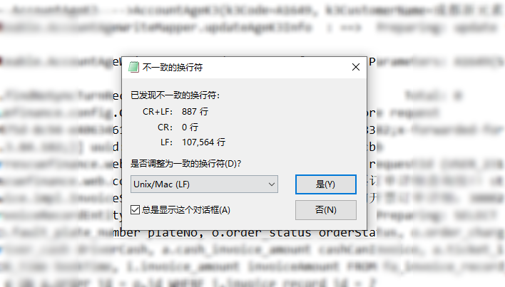

# Git的autocrlf与换行符

> 项目里面多工具开发时踩了换行符的坑 , 看了下还大有学问 , 写下这个避免将来再次踩坑

## 问题描述

公司项目使用了Git , 但是在分支上并未严格执行分支提交的流程 . 几个分支其实相互独立 , 分支上合并代码完全依靠`cherry pick` 和`patch`甚至复制粘贴文件 , 这种情况下分支间的代码比较就非常重要 .

问题就出在这里 , 遇到一个很诡异的情况 : 分支比较显示文件有差异 , 但是打开详情之后却没找到差异内容 . 我知道我同事使用的是Eclipse , 所以猜测 , 估计是不同开发工具带来的问题 .第一想法可能是 utf-8 与gbk的问题 , 但是打开之后发现都是 utf-8 ;  然后继续猜测是不是 utf-8 with bom的坑 , 使用了 idea 的`remove bom` 功能 , 居然还是一样 . 有点恼羞成怒 ,祭出大杀器 beyond compare , 分别拉取代码进行比较 , 结果更让我蛋疼 , 比较结果居然是正确的 , 和idea的比较结果完全不一样 , 顿时有点怀疑人生

本来其实到这里我也有点懒得折腾了 , 就当作见鬼了吧 . 我准备把另外分支代码去掉差异内容之后直接覆盖过来 , 然后再提交 , 心想这样应该也能解决问题吧 , 但是更见鬼的是 , idea竟然提示我没有差异内容

## 柳暗花明

之后我还尝试了 使用 Github Desktop , 结果反馈和 idea 一致 . 使用了 VSCode , 起初也没看出来有啥差别 ,  但是在我切换分支的时候 , VScode 竟然提示我说有冲突 , 并且恰好是 Git 提示差异文件的部分 . 思考了一下 大概可以确认文件的确有差异 , 并且这个东西是可以配置的 . 

确定了这一点就比较简单了 , 打开了公司的 gitlab ,下载源代码的压缩包 , 再次祭出Beyond compare 果然捉到了这只虫子 : 换行符的坑 . 其实之前我已经遇到过这个坑了([修复win平台下\r问题 智能预测情况](https://github.com/changdy/string_utils/commit/01674da8c66e1d3f388fb378f0668d98cae3cbbc)) ,但是当时没细研究 现在算是正好可以琢磨下了

## 还原问题-CRLF、LF、CR 三兄弟

常用换行符的有两个 , UNIX/Linux/Mac 使用的是 `0x0A`（LF）,DOS/Windows 使用的是`0x0D0A`（CRLF）.此外 Mac 系统早期使用了更诡异的 `0x0D`（CR）作为换行符 . 由于Git是 Linus  开发 , 自然也把 LF当作了标准 ,  并且在安装Git 的Windows客户端时 ,有个默认选项

**Checkout Windows-style , commit Unix-style line endings**



简单来说 检出时按照 Windows (CRLF) 风格 , 提交时转换成Unix (LF) 风格 , 坑就出现在这里 , 你检出的内容实际上可能会与服务器存储的文件有差异.因此我更推荐最下面的选项`Checkout as-is,commit as-is` ,简单来说是啥样就啥样.

不过 如果已经安装过 Git Windows 客户端也没必要重新安装 , 打开  Git Bash 输入如下命令即可

```shell
git config --global core.autocrlf false
```

另外 GitHub  Desktop 使用了内置 Git  其autocrlf 有可能需要单独配置 , 详见下文引用

## 文本的其他坑

当初曾接手过一个很老旧的项目 , 文件既有 utf-8,也有gbk.因此想把所有文件统一转成utf-8 但是找了好久都没找到 , 后来偶然看到一句话:"其实判断文本编码类型是比较复杂的 , 因为同一个文本可能同时存在多种编码" , 所以可能有些文件你尝试了所有的编码仍然有乱码 . 换行符也是如此  一个文本中也可能同时存在多种换行符 , 针对这种情况 , 建议开启 Git 的 safecrlf 



```shell
git config --global core.safecrlf true
```

为 true时 ,  Git 禁止提交 包含多种换行符的文本


## 其他引用

* [GitHub 第一坑：换行符自动转换 #22](https://github.com/cssmagic/blog/issues/22)
* [理解 CRLF，LF](https://www.jianshu.com/p/ec9564fe1c2b)
* [CRLF、CR、LF详解](https://www.jianshu.com/p/b03ad01acd69)
* [IntelliJ Idea设置默认换行符](https://blog.csdn.net/baidu_23275675/article/details/88075370)