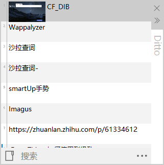
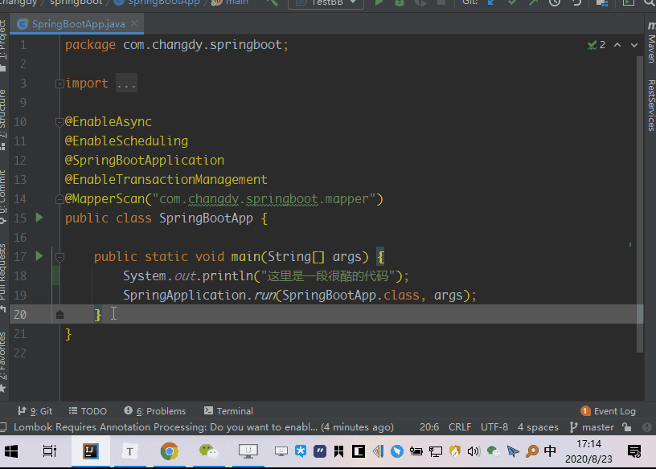
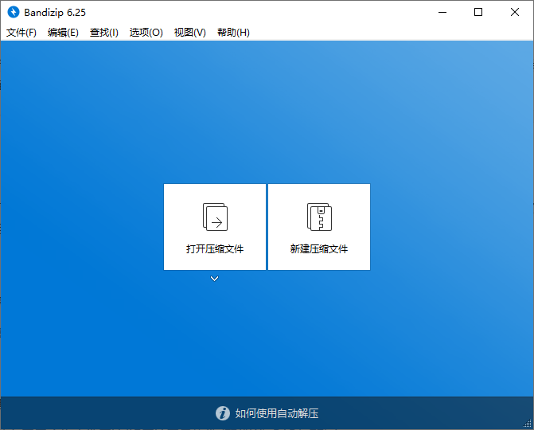
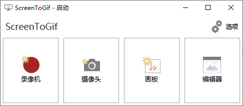
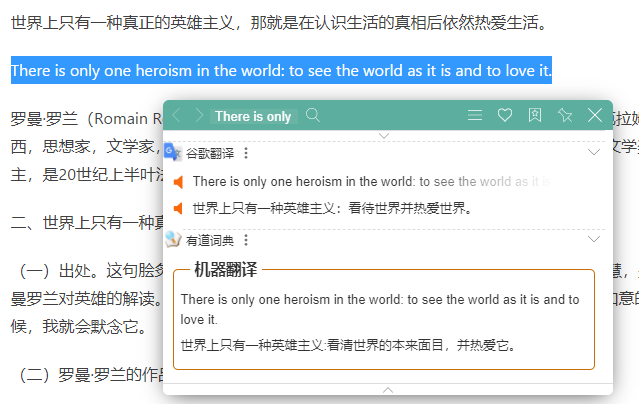
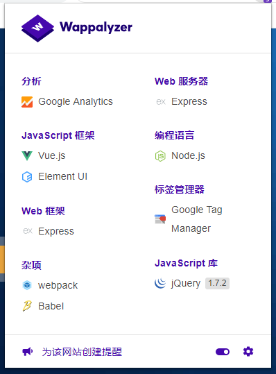

# 常用软件

> 分享下自己工作中用到的一些能提升自己工作的软件

## 效率软件

### Ditto

粘贴板增强工具 , 能记录并搜索历史的粘贴记录 ,易上手 (也有人嫌弃Ditto丑, 可以尝试ClipboardFusion)

相关文章: [免费开源的 Windows 管理剪贴板，让你处理文字更高效：Ditto](https://sspai.com/post/43700)

### Snipaste

截图+贴图工具 .较易上手.

截图功能优势不是很明显 , 但是贴图/标注功能非常实用 , 可以当作便签使用. 同时可以把粘贴板的富文本转换成图片 , 分享代码时十分有用, 效果图如下:

相关链接: [Windows 上最好的免费截图标注工具：Snipaste](https://sspai.com/post/34962)

### Capslock+

这是一款非常Geek的软件 , 介绍之前 , 我必须要说一声其上手难度比较高 , 仅适合对文字输入效率有要求的人.

操作有些类似vim  , 但是与vim不同的是其光标移动不再需要进行模式的切换 , 而是充分利用 `capslock` 这个几乎所有人都忘记的快捷键 , 用上之后基本上不需要再使用键盘本身的上下左右 , 避免右手频繁在字母区和方向键上移动 . 还有一些其他功能, 视频讲解比较全, 不再累述

相关链接: [【推荐】Capslock+让你键盘效率提升百倍的神器！｜Windows快捷键工具推荐](https://www.bilibili.com/video/BV1LK411p7wN)

### vs code

目前最优秀的文本编辑器 , 支持多种语言 , 插件丰富.

## 功能软件

### Postman

官网自述: `The Collaboration Platform for API Development`  . 这个软件不仅仅用来发送请求 , 其他一些高级功能 , 比如 `pre-request scripts` ,`Test` , swagger api文档导入都有很实用的价值 . 

在技师项目中 我使用 直接导入swagger json , 就可将技师项目的所有接口一次性导入到postman中. 并且配合 `pre-request scripts` 就可达到模拟登陆的效果 , 只要输入手机号即可获取接口返回值.

### Fiddler

功能非常强的抓包工具 ,  搭配脚本还可以对请求/返回值进行二次修改 . 但是比较可惜的是 新版本 `fiddler-everywhere`为了跨平台 , 使用了`Electron` , 丢失了之前的脚本功能 , 想使用脚本的话 ,需要用之前的旧版本

### Everything

本地文件搜索 ,  速度极快 , 有时候经常忘记一个文件放到那里了 , 这个就可以派到用场

相关链接 : [EveryThing 如何使用到极致](https://zhuanlan.zhihu.com/p/61334612)

### Bandizip

解压缩工具 , 与国内的各种垃圾解压工具相比 , 颜值较高 , 布局整洁 .双击即可解压  . 新版本有广告 , 建议用旧版本

相关链接: [Bandizip 中文版 - 优秀好用的免费无广告文件压缩/解压缩工具软件 (替代WinRAR与7Zip)](https://www.iplaysoft.com/bandizip.html)

### Beyond Compare

文件比较大杀器 ,可以比较 .class文件 . 目录比较功能也非常实用 , 不过现在vs code 的文件比较也非常不错. 

### ScreenToGif

截屏转gif ,  上面的那个`Snipaste`介绍就是通过 `ScreenToGif` 录制的  , 可以非常方便的分享操作 . 并且还带有强大的编辑功能 

### 迅雷

虽然一直说迅雷是毒瘤 , 但仍旧是最适合国内的下载软件 , 不过可以找下之前的去广告第三方版本 

## 必备技能

### JavaScript/正则

这两个一直都被认为是前端的范畴 , 但其实我觉得这是程序员的基础技能. 这篇文章介绍的很多软件也都提供了这两个的支持

虽然一直吐槽js这门语言 ,但不得不承认js得天独厚 , 尤其是在`Electron`加持后 , 用武之地非常多. `css`也要学会最基础的隐藏/显示 . 

学会正则之后能非常方便的提取关键数据 

相关链接 : [正则表达式30分钟入门教程](https://deerchao.cn/tutorials/regex/regex.htm) 

### Excel

我曾开玩笑说`Excel` 也是数据库  , 其实不假 .学会使用`Excel` 的一些函数 , 也能节省很多时间 ,有些聚合操作在`Excel`上实现会非常轻松 , 比如 `vlookup`  .当下次遇到多钟数据源时 , 不妨考虑在`Excel` 中进行聚合

### 多光标操作

相关链接: [VSCode 多光标](https://geek-docs.com/vscode/vscode-tutorials/vs-code-multi-cursor.html)

## chrome扩展

### Tampermonkey

可以在网页上运行指定的js脚本(js很重要+1), 实现一些定制化的功能 , 

相关链接: [Chrome 插件大杀器：「油猴」Tampermonkey 使用详解](https://zhuanlan.zhihu.com/p/99390731)  , [有哪些超神的油猴脚本？](https://www.zhihu.com/question/22210090)

### smartUp手势

充分利用鼠标右键 , 赋予右键很多功能

### 沙拉查词

chrome上最优秀的翻译扩展程序

### Wappalyzer

分析当前网站使用了那些技术

### Adblock Plus

屏蔽那些无聊的广告